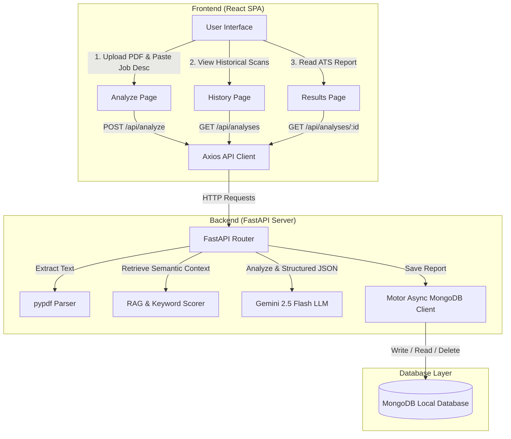

# ResumeIQ - AI Resume Screening & Job Matching Platform

ResumeIQ is a GenAI-powered Applicant Tracking System (ATS) matching platform. It allows candidates and recruiters to instantly upload a resume in PDF format, paste a job description, and obtain a structured, objective ATS compatibility report including an overall match score, detailed score breakdowns (skills, experience, education, keywords), extracted matching skills, identified skill gaps, career recommendations, and tailored interview prep questions.

---

## Architecture Diagram

Here is the high-level architecture of the application, representing how the frontend, backend, database, and LLM integrate:



---

## Technology Stack

### Frontend
- **Framework**: React (pure functional components with Hooks)
- **Routing**: `react-router-dom`
- **Styling**: Tailwind CSS
- **Icons**: `@phosphor-icons/react`
- **Component Library**: Radix UI primitives (packaged via `shadcn/ui` components like dialog, toaster, input, etc.)
- **Query Handler**: `@tanstack/react-query`
- **API Client**: Axios

### Backend
- **Framework**: FastAPI (Python)
- **Database Driver**: Motor (Asynchronous Driver for MongoDB)
- **PDF Extraction**: `pypdf`
- **AI Integration**: Official Google Gemini SDK (`google-generativeai`) using the `gemini-2.5-flash` model
- **Environment**: `python-dotenv` for configuration

### Database
- **Database**: MongoDB (Local Document Store)

---

## Project Structure

```
ATS-Genius-main/
├── backend/
│   ├── venv/                 # Backend virtual environment
│   ├── server.py             # FastAPI entrypoint, endpoints, and middleware
│   ├── llm_service.py        # Gemini API connector and prompt templates
│   ├── pdf_utils.py          # PDF text extraction using pypdf
│   ├── rag_utils.py          # TF-IDF semantic chunking and RAG utilities
│   ├── requirements.txt      # Python dependencies list
│   └── .env                  # Backend environment variables
│
├── frontend/
│   ├── src/
│   │   ├── components/       # Global components (Navbar.jsx)
│   │   │   └── ui/           # Radix/Tailwind components (button, input, etc.)
│   │   ├── pages/            # Page routing targets (Home, Analyze, Results, History)
│   │   ├── lib/              # api.js and utils.js (Axios setup and helper functions)
│   │   ├── constants/        # Test IDs and routing constants
│   │   ├── App.js            # Main application layout and routes
│   │   └── index.js          # React entrypoint
│   ├── package.json          # Frontend packages and scripts
│   └── tailwind.config.js    # Tailwind layout styles
│
└── README.md                 # This file
```

---

## Installation & Running Locally

### Prerequisites
- **Node.js**: v16+
- **Python**: v3.10+
- **MongoDB**: Installed and running locally on standard port `27017`

---

### Step 1: Run the Backend

1. Navigate to the `backend/` directory:
   ```bash
   cd backend
   ```
2. Activate the virtual environment:
   - **Windows**:
     ```bash
     venv\Scripts\activate
     ```
   - **macOS/Linux**:
     ```bash
     source venv/bin/activate
     ```
3. Ensure configuration `.env` file exists inside `backend/` with the following variables:
   ```env
   MONGO_URL=mongodb://localhost:27017
   DB_NAME=resume_ai
   GEMINI_LLM_KEY=YOUR_GEMINI_API_KEY
   CORS_ORIGINS=http://localhost:3000
   ```
4. Start the FastAPI development server:
   ```bash
   python -m uvicorn server:app --port 8000 --reload
   ```
   The backend API will be available at `http://localhost:8000`.

---

### Step 2: Run the Frontend

1. Navigate to the `frontend/` directory:
   ```bash
   cd ../frontend
   ```
2. Install frontend dependencies:
   ```bash
   npm install
   ```
3. Ensure the configuration `.env` file exists inside `frontend/` containing the API endpoint:
   ```env
   REACT_APP_BACKEND_URL=http://localhost:8000
   ```
4. Start the React development server:
   ```bash
   npm start
   ```
   The frontend UI will automatically open in your browser at `http://localhost:3000`.

---

## Key Features & Endpoints

### Backend APIs (`/api/*`)
- **GET `/api/`**: API Health check and status.
- **POST `/api/analyze`**: Accepts resume PDF (multipart file upload), target job title, job description, and session ID. Parses the resume, computes semantic keyword overlap, runs the Gemini prompt analysis, stores the resulting document, and returns the analysis data.
- **GET `/api/analyses`**: Lists the past analyses matching the local user's unique `session_id`.
- **GET `/api/analyses/{analysis_id}`**: Retrieves a single detailed analysis report.
- **DELETE `/api/analyses/{analysis_id}`**: Deletes an analysis report from MongoDB.
